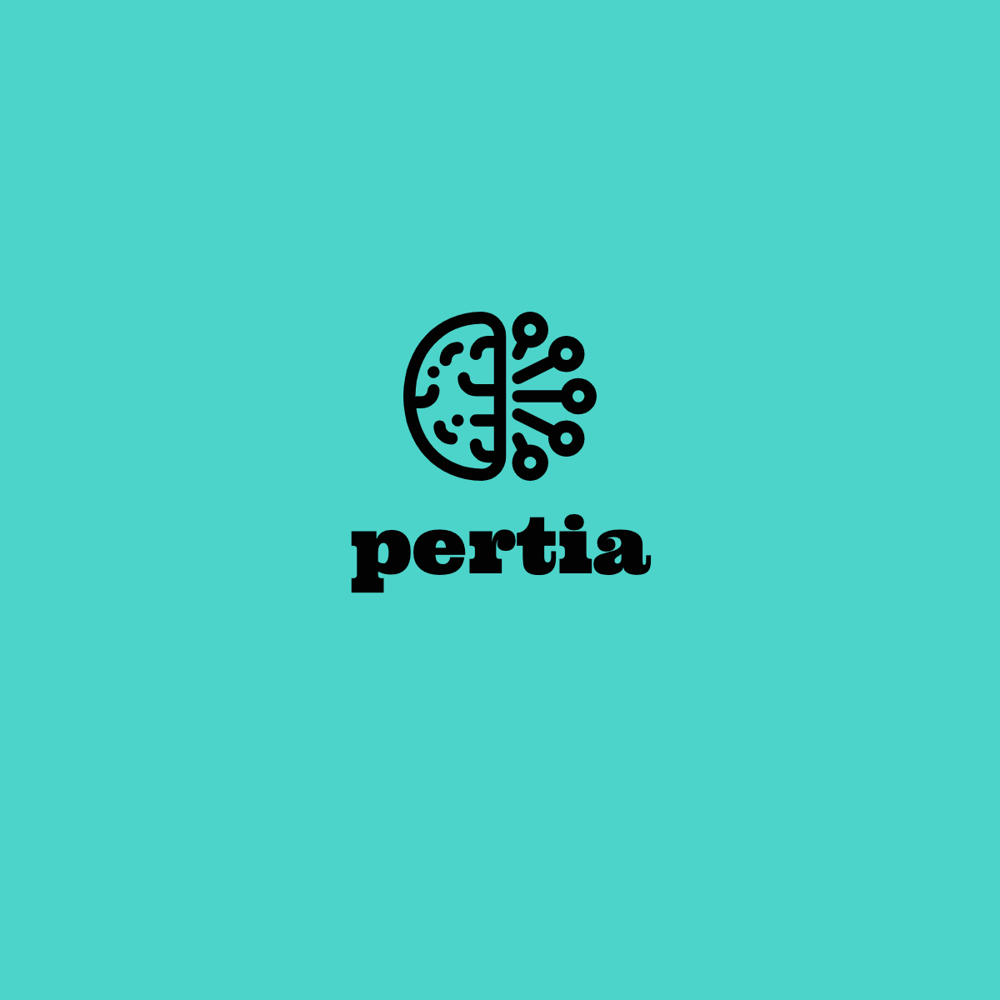

### Have a Dream Job?
What's the secret sauce? What skills might need to be on your resume to make it past the automated screening? Ever wonder what it takes to land that dream job in your area? A spin on the Latin word "peritia", meaning expertise, experience, knowledge, ability, mastery. [Pertia.info](https://pertia.info) can help identify what skills you will need to master, to secure that coveted position.

### Web App
Pertia is a job board aggregator of in-demand skill sets, that when given a specific region and job title will return a ranked list of skills/technical knowledge based on job listing demand. This supplement to the average job board can help you know how to tailor your resume to focus on what the job market is interested in seeing and it can open your eyes to where there might be gaps in your skill set.

## License & Copyright

## Installation

## Development

## Project Organization

*Project idea credited to Daniel Keaton.
